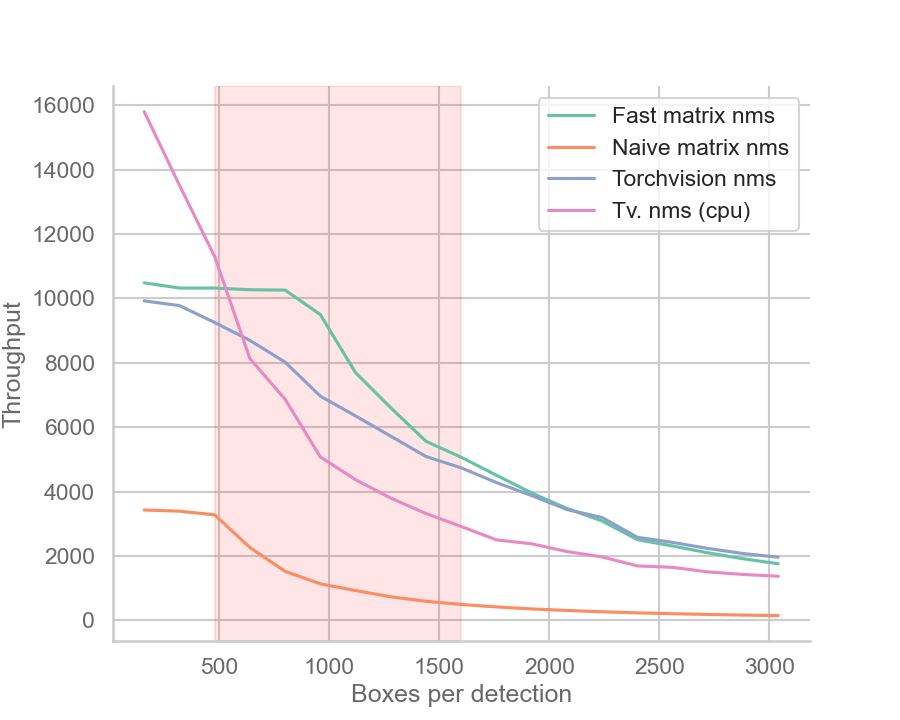

# Fast Matrix NMS
A fast CUDA implementation of the **matrix non-max suppression** algorithm for PyTorch. Works on bounding box predictions. See [SOLO v2](https://arxiv.org/pdf/2003.10152.pdf) for the original paper, and [AdelaiDet](https://github.com/aim-uofa/AdelaiDet/blob/4a3a1f7372c35b48ebf5f6adc59f135a0fa28d60/adet/modeling/solov2/utils.py#L146]) for the official implementation for masks.

This project is still in development. I am working on some more optimizations that can achieve higher throughput. Separate functions for fast IoU matrix computation and relevant stuff are also in the works.

<p align="center">
  
</p>

## Why
The algorithm is highly parallelizable, consisting of mainly matrix operations. When applied to **mask predictions**, the authors saw a huge speedup over Hard-NMS and Soft-NMS (*<1ms vs 9ms vs 22ms*) in their codebase. However, that excludes the time for IoU matrix computation, which is not negligible, and Hard-NMS does not necessarily require the whole IoU matrix. Also, it is unclear how efficient and optimized the implementations used for comparison are.


When applied to **bounding box predictions**, a naive `torch` implementation of matrix NMS based on the pseudo-code given in the paper, [mmdetection's implementation](https://github.com/open-mmlab/mmdetection/blob/master/mmdet/core/post_processing/matrix_nms.py), and [AdelaiDet's implementation](https://github.com/aim-uofa/AdelaiDet/blob/master/adet/modeling/solov2/utils.py) is *much slower* than `torchvision.ops.nms` (see [benchmark](#benchmark)). I believe that if implemented correctly, matrix NMS can be fast; that is it can at least **achieve a comparable or faster speed** against a pretty optimized `torchvision.ops.nms`.


## Installation
This comes in form of a PyTorch CUDA extension. Make sure your system has CUDA installed and a CUDA-enabled PyTorch installation. To build the extension, run:
```bash
python setup.py build_ext --inplace
```

To install the extension, run:

```bash
python setup.py install
```

## Usage
Once installed, it can be used similarly to `torchvision.ops.nms` with a little adjustment.

As of now, note that the number of boxes must be a multiple of 16, as it enables some optimization (mainly avoiding lots of warp divergence). Normally, one would first filter the box predictions over a confidence threshold and then apply NMS, now one should add more boxes or remove some boxes to satisfy the requirement, for example:

```python
from matrix_nms import fast_matrix_nms

# boxes: (N, 4)
# scores: (N, )
boxes = boxes[:boxes.shape[0] // 16 * 16].contiguous()
scores = scores[:scores.shape[0] // 16 * 16].contiguous()
```
  
Then, apply fast matrix NMS:
  
```python
# threshold: float
keep_indices = fast_matrix_nms(boxes, scores, threshold)
boxes = boxes[keep_indices]
scores = scores[keep_indices]
```

where `threshold` is the after-decay score threshold associated with the algorithm. I have not experimented a lot with this parameter. I recommend starting with 0.3-0.4 for bounding boxes and adjust accordingly. In the [official repository](https://github.com/aim-uofa/AdelaiDet/blob/4a3a1f7372c35b48ebf5f6adc59f135a0fa28d60/adet/config/defaults.py#L321), it seems to be 0.05 for masks.


## Benchmark
The results are benchmarked using `torch.benchmark` on a NVIDIA RTX 2060 and AMD Ryzen 7 4800H CPUs. The benchmark script is [`speedtest.py`](./speedtest.py).


The figure way above shows the throughput (detections processed per second) of matrix NMS, `torchvision.ops.nms`, and a naive implementation of matrix NMS.


<table border="0" <th style="width:100%">
  <tr>
  <th style="width:50%"> Speedup over naive implementation </th>
  <th style="width:50%"> Inference time comparison (useless) </th>
  </tr>
  <tr>
  <td valign="bottom">
  <p align="center">
  
  </p>
  </td>
  <td valign="top">
  <p align="center">
  
  </p>
  </td>
  </tr>
</table>

There are some notes to be made:

- When the number of boxes per detection is in the 500-1500 range, fast matrix NMS has higher throughput than both CPU and CUDA versions of `torchvision.ops.nms` on an RTX 2060.

- The worst and best case runtime of matrix NMS is constant and equal to the average runtime, while `torchvision.ops.nms` may run faster or slower depending on the input (box IoUs and threshold).

- As the number of boxes increases over ~1600, the throughput of fast matrix NMS slowly converges to that of CUDA `torchvision.ops.nms`, then eventually becomes slower. This is due to my GPU hitting its parallel computation limit, plus the overhead of memory allocation and data transfer. A better GPU would see better performance and vice versa.

- Fast matrix NMS can be further tailored for different hardware and systems, and there are more optimizations that I am working on.

## How
In summary, this implementation fuses multiple steps into 3 CUDA kernels with some tricks to achieve high parallelism and low memory usage/allocation overhead:

- Compute the lower triangular of the IoU matrix $O\in \mathcal{R}^{N\times N}$, and perform the first max reduction.
- Perform the remaining max reduction on the IoU matrix to obtain the row-wise maximums $O_{max}\in \mathcal{R}^N$
- Compute the possible decay factor and possible scores $S'=F(S,O,O_{max}) \in \mathcal{R}^{N\times N}$ and select the boxes to remove, skipping the finding of the minimum decay factor for each box: if $\exists i:S'_{xi}<\mathrm{threshold}$, then detection $x$ should be removed.

I am writing a blog post on the details of the implementation (optimizations, tricks used, limitations, etc.) and discuss other NMS methods :innocent:

## License
This project is released under the MIT License. Please see the [LICENSE](./LICENSE) file for more information.